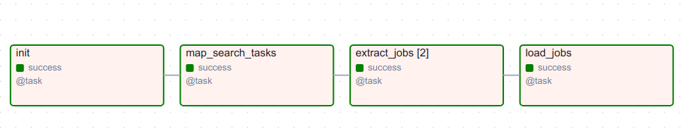
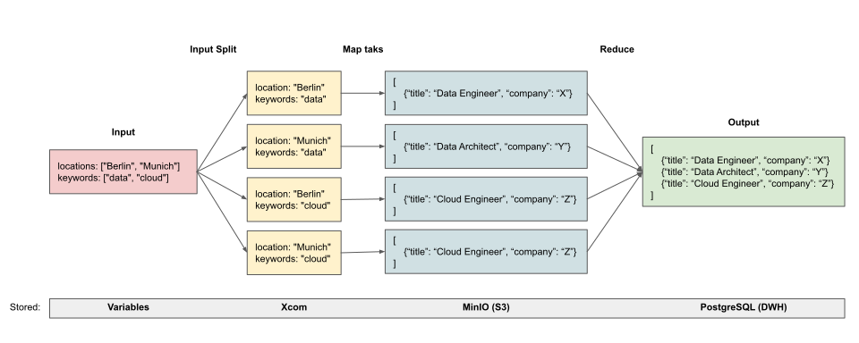

# Overview
This repo contains a pipeline example for web scraping 🕸️🌐  
Open positions from LinkedIn job search page are extracted and saved into a database in this example.
The key feature of this pipeline is the **parallelization** of the extraction tasks, applying the MapReduce pattern  🗺️📉  
The map step leverages **dynamic parameters** (variables) to distribute the workload across multiple tasks, thereby accelerating the web scraping process ⚡🚀

## Solution
- **Airflow**: for task orchestration, utilizing the TaskFlow API
- **MinIO**: a local S3 storage for intermediate results, where JSON files from each extract task instance are stored. Alternatively, AWS S3 can be used since the pipeline leverages the Airflow's S3 hook
- **PostgreSQL**: a Data Warehouse to store the extracted job data

## Dynamic Task Mapping
Airflow supports dynamic task generation.  
In this example, the DAG consists of 4 steps, with the `extract_jobs` task dynamically mapped into multiple parallel tasks.

### DAG tasks

- init - to create a database table and S3 bucket if not exist
- map_search_tasks - to map the input variables as a Cartesian product of *locations* and *keywords_list* into multiple tasks
- extract_jobs - dynamic number of tasks to scrape jobs from LiknedIn, results from each taks instance are stored in MinIO as JSON files
- load_jobs - to reduce multiple extraction results and save unique jobs in PostgreSQL

### MapReduce visualization


## How to Use
1. Rename `*.env.example*` to `*.env*` and adjust the parameters as needed.
2. Run `docker compose up`.
3. Access the Airflow UI (default URL: http://localhost:8080/).
4. Configure the following connections under *Admin -> Connections*:
   - PostgreSQL:
        - Connection Id: *postgres_conn*
        - Connection Type: *Postgres*
        - Host: *postgres*
        - Database: *airflow*
        - Login and Password: *airflow*
        - Port: *5432*
   - MinIO:
        - Connection Id: *s3_conn*
        - Connection Type: *Amazon Web Services*
        - AWS Access Key ID and Secret Access Key: *minioadmin*
        - Extra: *{ "endpoint_url": "http://minio:9000" }*
5. Set variables in *Admin -> Variables*  
For example:
    ```
    {
        "locations": ["Berlin", "Munich"]
        "keywords_list": ["data", "cloud"],
    }
    ```
6. Trigger the `find_jobs` DAG.
